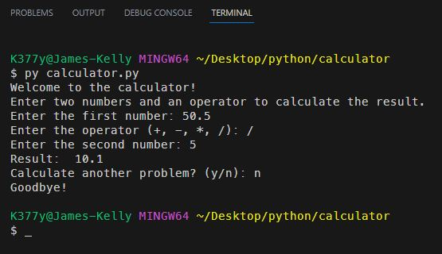

# Simple Calculator

## *Description*
This is a basic arithmetic calculator that can add, subtract, multiply, and divide two numbers.
 

## *Installation* and *Usage*
To install this game, simply clone the repository and run the `calculator.py` file in your terminal.
 
When prompted, enter a whole or decimal number.
Then, enter the operator you wish to use.
Finally, enter another whole or decimal number.
 

 
 

## *Questions*
<h3>Portfolio:&emsp;<a href="https://jk377y.dev" target="_blank">https://jk377y.dev</a></h3>
<h3>Email:&emsp;<a href="mailto:jk377y@gmail.com" target="_blank">jk377y@gmail.com</a></h3>
<h3>LinkedIn:&emsp;<a href="https://www.linkedin.com/in/james-kelly-software-developer/" target="_blank">https://www.linkedin.com/in/james-kelly-software-developer/</a></h3>
<h3>GitHub:&emsp;<a href="https://github.com/jk377y" target="_blank">https://github.com/jk377y</a></h3>

## *License*

 Copyright (c) 2023 James Kelly
 Information on this license can be found at: (https://opensource.org/licenses/MIT)